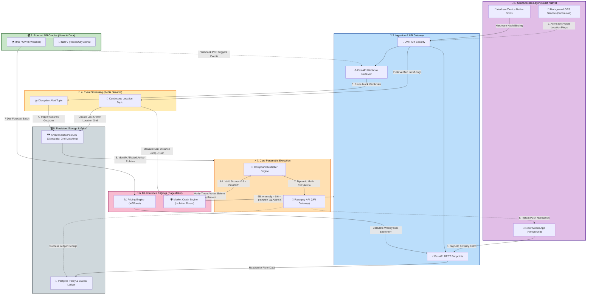
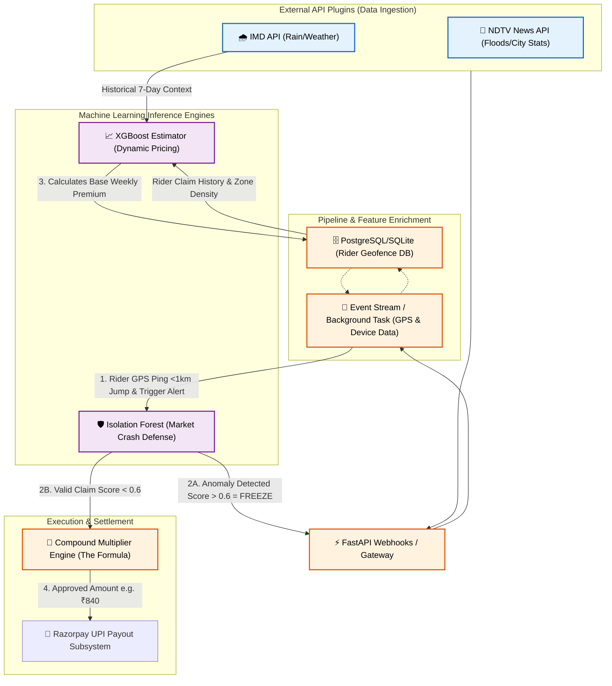

# 🚀 GigShield Phase 2 Execution & Integration Plan

This document outlines everything needed to execute the Phase 2 Minimum Viable Product (MVP) based on your system design. It is structured explicitly to allow a seamless upgrade into the commercial product described in the **Final Startup Roadmap** (Month 1 - 3).

---

## 🏗️ 1. Tech Stack (Phase 2 MVP vs. Production Upgrade)

We are selecting an MVP tech stack that maps perfectly 1-to-1 with your final Day 90 startup stack, ensuring no throwaway code.

| Component | Phase 2 MVP (Now) | Startup Roadmap Upgrade Path (Day 31+) |
| :--- | :--- | :--- |
| **Frontend** | **React Native (Expo)** - Fast prototyping | **React Native (Bare Workflow)** - Native Swift/Kotlin for Aadhaar eKYC |
| **Backend** | **Python FastAPI** - Async speed, ML ready | **Dockerized FastAPI** on Kubernetes (AWS EKS) |
| **Database** | **SQLite** - Local, zero-config, portable | **Amazon RDS (PostgreSQL + PostGIS)** for massive geospatial scale |
| **AI / ML** | **Scikit-Learn (Local)** - Python mock pipelines | **AWS SageMaker** - Nightly batch jobs & live inference |
| **Event Stream** | **FastAPI Background Tasks** | **Redis Streams (Amazon ElastiCache)** - Non-blocking queues |

---

## 📐 2. End-to-End System Architecture

This outlines the complete architecture moving from the Phase 2 MVP directly into the Day 90 Production Startup model, visualizing how data flows from the rider's pocket, through security boundaries, into our AI, and out to their bank account in < 300 milliseconds.



### MVP Simulation Context

For the immediate Phase 2 executable codebase, this architecture simulates the following async flows:
1. **Client Device:** React Native app posts user location and registration data to the backend.
2. **API Layer:** FastAPI receives requests (simulating the future API Gateway).
3. **Trigger Simulation:** Instead of integrating live Redis Streams just yet, FastAPI will expose secure mock Webhook endpoints.
4. **Data Verification:** SQLite handles the logic (simulating PostgreSQL & PostGIS). 
5. **Wallet Settlement:** Virtual wallet updates replace live Razorpay API calls for the 2-minute demo.

*Upgrade Note:* By using `async def` endpoints in FastAPI from Day 1, integrating Redis Streams in Month 2 will be a pure plug-and-play operation.

---

## 🔗 3. ML Models & API Connectivity Architecture

This section details the direct data flow between the external plugins and the core ML engines for Phase 2.



### The Three Connectivity Bridges

1. **The Pricing Bridge (XGBoost ↔ APIs):** Controls the flow of money *into* the pool. The `XGBoost API` fetches 7-day historical weather aggregates from the **IMD plugin** and combines it with rider risk profiles to output a dynamic weekly premium. 
2. **The Verification Bridge (APIs ↔ Validation Logic):** When the **NDTV API plugin** fires a "Severe Urban Flooding" webhook, the system queries the internal stream to verify Rider GPS background pings within the flooded bounding box.
3. **The Defense Bridge (Isolation Forest ↔ GPS Streams):** Protects money flowing *out*. The embedded `Scikit-Learn Isolation Forest` calculates an anomaly score using real-time distance jumped (ensuring max jump remains < 1 km) and IP subnet clusters. A high score halts the payout; a low score releases the funds via Razorpay.

---

## 🔌 4. API Integration Flow

This specifies how we build the mock API data ingestion layer for the MVP so that it naturally unplugs to accept live data later.

### 1. Webhook Endpoints (Simulating Push Streams)
Instead of running Cron jobs to blindly fetch APIs (which consumes too many resources), the FastAPI application will expose secure endpoints e.g., `/api/v1/webhooks/ndtv`. We will simulate the external APIs "pushing" a disruption alert to us.

### 2. JSON Payload Contracts
The backend expects precise JSON payloads to trigger the `Compound Multiplier Engine`. For example, the simulated **NDTV Flood Alert Payload** will look like this:
```json
{
  "source": "ndtv_news_api",
  "trigger_type": "SEVERE_FLOOD",
  "geo_fence": {
    "center_lat": "12.9121",
    "center_long": "77.6446",
    "radius_km": 2.5
  },
  "severity_index": 0.85,
  "timestamp": "2026-03-31T18:00:00Z"
}
```

### 3. Integration Path
1. **MVP Execution:** You click a "Trigger NDTV Alert" button on the UI, which POSTs that exact JSON to the FastAPI webhook.
2. **Post-MVP Upgrade:** This endpoint gets deleted, and the exact same JSON schema is mapped to a deployed Redis stream listening to live NDTV and IMD feeds.

---

## 📂 5. File Structure

This is the exact directory structure you need to create to house the Phase 2 source code executable, mapped entirely to the End-to-End architecture above:

```text
gigshield_phase2/
├── backend/
│   ├── main.py                     # Primary FastAPI Gateway Entry
│   ├── api/
│   │   └── v1/
│   │       ├── webhooks.py         # Mock payload receivers (NDTV, IMD alerts)
│   │       ├── policies.py         # Policy fetching & creation
│   │       └── rider.py            # JWT Auth & Continuous GPS stream receivers
│   ├── core/
│   │   ├── execution_engine.py     # Compound Multiplier Math & Razorpay Settlement
│   │   ├── stream_processor.py     # Simulating the Redis Streams event queues 
│   │   └── config.py               # Application configuration
│   ├── database/
│   │   ├── session.py              # SQLite logic (simulating PostgreSQL PostGIS)
│   │   ├── models.py               # Policy, Claim Ledger, Geospatial logic
│   │   └── crud.py                 # Core Reads/Writes 
│   ├── ml_pipelines/
│   │   ├── xgboost_pricing.py      # AI Weekly Dynamic Base Premium Calculator
│   │   └── isolation_forest.py     # Market Crash anomaly block (< 1km GPS verifier)
│   └── requirements.txt            # Python dependencies
└── frontend/
    ├── App.js                      # React Native entry point
    ├── services/
    │   └── BackgroundLocation.js   # Async Foreground/Background silent tracker
    ├── screens/
    │   ├── OnboardingScreen.js     # Simulated Biometric KYC / Wallet bind
    │   ├── ShieldDashboard.js      # Map geometric view & active AI premium 
    │   └── SettlementScreen.js     # 300ms auto-payout & Push Notification simulator
    └── package.json                # React Native dependencies
```

---

## 🧠 6. AI Plan (Dynamic Pricing Engine)

**Phase 2 Goal:** Demonstrate mathematical, hyper-local pricing.
* **The Code:** We will write a deterministic function in `xgboost_pricing.py` that mocks early ML outputs.
* **The Logic:** It accepts three variables: `base_rate` (₹45), `zone_risk_factor` (e.g., Red Zone + ₹45), and `weather_penalty` (e.g., high rain probability + ₹15). 
* **Integration:** This cleanly matches the future state where AWS SageMaker will absorb these identical JSON vector inputs to return the final price point every Monday morning.

---

## 🛡️ 7. Market Crash Plan (Fraud Defense Implementation)

This is the crown jewel of your architecture. The Phase 2 MVP must implement these mathematically to prove the ₹6.45 Cr liquidity pool is safe:

1. **GPS Displacement Engine:** 
   * **Rule:** Must block teleportation. 
   * **MVP Code:** Include a check verifying that time elapsed and distance jumped do not exceed physical capabilities. Ensure the maximum jump radius threshold is strictly **1 km** to detect minute hyper-local anomalies (rejecting the old standard of massive Kolkata to Delhi style jumps).
2. **The 48-Hour Immutable Time Lock:**
   * **Rule:** You cannot buy a policy today and claim it today.
   * **MVP Code:** Enforce a boolean in the SQLite DB that hard-rejects any payout if `account_age_hours < 48`.
3. **Graph-Clustering IP Defense (The Syndicate Stop):**
   * **Rule:** Prevent 500 fake emulators from claiming simultaneously.
   * **MVP Code:** When a trigger fires, parse the claim objects grouped by simulated IP subnets. If `count > N` per subnet, immediately flag and freeze the transaction cluster via the `isolation_forest.py` logic.

---

## 📋 8. Requirements for the 2-Minute Demo Video

To execute the DEVTrails submission perfectly, ensure you check off these interactive flows in the UI:
- [ ] **Scene 1 (Onboarding):** Register a mock user (Arjun) and assign him a "Zone".
- [ ] **Scene 2 (AI Pricing):** Show the dynamic premium calculation generating a unique weekly cost.
- [ ] **Scene 3 (The Disaster):** Click a button on a web dashboard to trigger a "Severe Flooding Data Feed" from NDTV APIs. 
- [ ] **Scene 4 (The Miracle):** Show the React Native app instantly receive a Push Notification: *"Trigger matched. Checking location. 1km validation passed. ₹840 credited."*
- [ ] **Scene 5 (The Syndicate Attack):** Simulate a push of 50 simultaneous claims and watch the Market Crash Engine instantly freeze them.

By following this exact blueprint, your Phase 2 executable codebase won't just win a hackathon—it will literally become the Day 1 code of your funded startup.
